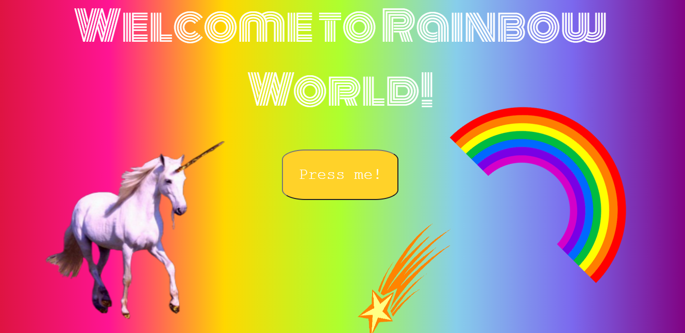

# Rainbow World / Boring World

###### April 2020

_This was a fun little project I made early on when I was exploring the use of images, animation, background gradients and interacting with the DOM._

### Main Learning Points:

- I practiced interacting with the DOM and used location.replace to replace the current document (Rainbow World) with another one (Boring World) and window.confirm and prompt to display dialougue boxes prompting for user input / response.
- I used @keyframes and some transform properties (scale, rotate and skew) to animate images and I also learnt some animantion properties (animation duration, iteration count, timing function and direction).
